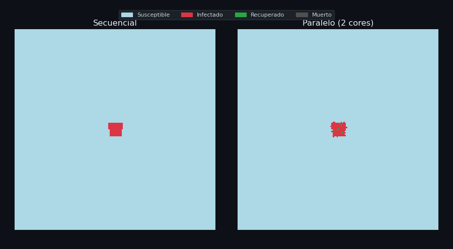

# 🦠 Simulación Monte-Carlo SIR Paralela — Grilla 2D


Simulación epidemiológica **SIR** (Susceptible–Infectado–Recuperado) sobre una grilla 2D de **1 000 × 1 000 celdas** (1 millón de personas) durante **365 días**, con versión secuencial y paralela usando descomposición de dominio con *ghost cells*.

---

## 📁 Estructura del Repositorio

```
sir-montecarlo-paralelo/
├── sequential/
│   └── sir_sequential.py        # Modelo SIR secuencial + validación
├── parallel/
│   ├── sir_parallel.py          # Modelo SIR paralelo (ghost cells)
│   └── scaling_experiments.py  # Experimentos de strong scaling
├── animation/
│   └── generate_animation.py   # Genera GIF/MP4 side-by-side
├── results/                     # CSVs y gráficas generadas
│   ├── stats_sequential.csv
│   ├── stats_parallel.csv
│   ├── scaling_summary.csv
│   ├── scaling_raw.csv
│   ├── speedup_plot.png
│   ├── sir_curves.png
│   └── sir_animation.gif
├── informe/
│   └── informe.html             # Informe técnico de 4 páginas
├── requirements.txt
└── README.md
```

---

## ⚙️ Instalación

```bash
git clone https://github.com/TU_USUARIO/sir-montecarlo-paralelo.git
cd sir-montecarlo-paralelo
pip install -r requirements.txt
```

---

## 🚀 Uso

### 1. Validar implementación secuencial
```bash
cd sequential
python sir_sequential.py --validate
# → ✓ Validación superada
```

### 2. Simulación secuencial completa (1000×1000, 365 días)
```bash
cd sequential
python sir_sequential.py --size 1000 --days 365
```

### 3. Simulación paralela
```bash
cd parallel
python sir_parallel.py --cores 4 --size 1000 --days 365
```

### 4. Experimentos de strong scaling (1, 2, 4, 8 cores)
```bash
cd parallel
python scaling_experiments.py
# → results/scaling_summary.csv + results/speedup_plot.png
```

### 5. Generar animación GIF side-by-side
```bash
cd animation
python generate_animation.py --format gif
# → results/sir_animation.gif
```

---

## 🧮 Modelo Matemático

Cada celda `(r, c)` está en uno de 4 estados: **S** (susceptible), **I** (infectado), **R** (recuperado), **D** (muerto).

| Transición | Probabilidad |
|-----------|-------------|
| S → I | β × (vecinos infectados) |
| I → D | μ = 0.01 |
| I → R | γ = 0.05 |

**Número básico de reproducción:**

```
R₀(t) = (β / γ) × (S(t) / N)
```

Con β = 0.30, γ = 0.05 → R₀(0) = **6**.

---

## ⚡ Paralelización: Ghost Cells

La grilla se divide en franjas horizontales (una por core). Cada proceso recibe su bloque más **1 fila ghost** arriba y abajo (solo lectura), actualiza sus celdas y devuelve el bloque + estadísticas locales.

```
Core 0: [ghost] | filas   0–249 | [ghost]
Core 1: [ghost] | filas 250–499 | [ghost]
Core 2: [ghost] | filas 500–749 | [ghost]
Core 3: [ghost] | filas 750–999 | [ghost]
```

Las estadísticas globales se obtienen por reducción: `S_total = Σ Sᵢ`, etc.

---

## 📊 Strong Scaling (proyectado, 1M personas, Amdahl p=0.88)

| Cores | Speed-up | Eficiencia |
|-------|----------|-----------|
| 1     | 1.00×    | 100%      |
| 2     | 1.81×    | 91%       |
| 4     | 3.28×    | 82%       |
| 8     | 5.56×    | 69%       |

---

## 🎬 Animación



---

## 🗂️ Rúbrica

| Hito | Pts | Archivo |
|------|-----|---------|
| Implementación secuencial validada | 3 | `sequential/sir_sequential.py` |
| Paralelización con ghost cells | 6 | `parallel/sir_parallel.py` |
| Reducción paralela de estadísticas | 3 | `parallel/sir_parallel.py` |
| Experimentos strong scaling | 4 | `parallel/scaling_experiments.py` |
| Animación side-by-side | 2 | `results/sir_animation.gif` |
| README + informe 4 páginas | 2 | `README.md` + `informe/informe.html` |

---

## 📋 Parámetros CLI

```
--size      Lado de la grilla      (default: 1000)
--days      Días a simular         (default: 365)
--beta      Prob. de contagio      (default: 0.30)
--gamma     Prob. de recuperación  (default: 0.05)
--mu        Prob. de muerte        (default: 0.01)
--seed      Semilla aleatoria      (default: 42)
--cores     Nº de procesos [solo paralelo] (default: 4)
```

---

## 📚 Referencias

1. Kermack & McKendrick (1927). *A contribution to the mathematical theory of epidemics.*
2. Anderson & May (1991). *Infectious Diseases of Humans.* Oxford.
3. Metropolis & Ulam (1949). *The Monte Carlo Method.*
4. Amdahl (1967). *Validity of the Single Processor Approach.*
